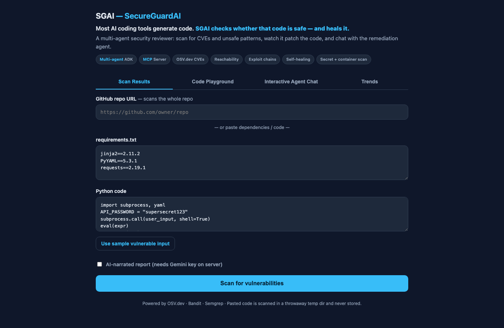
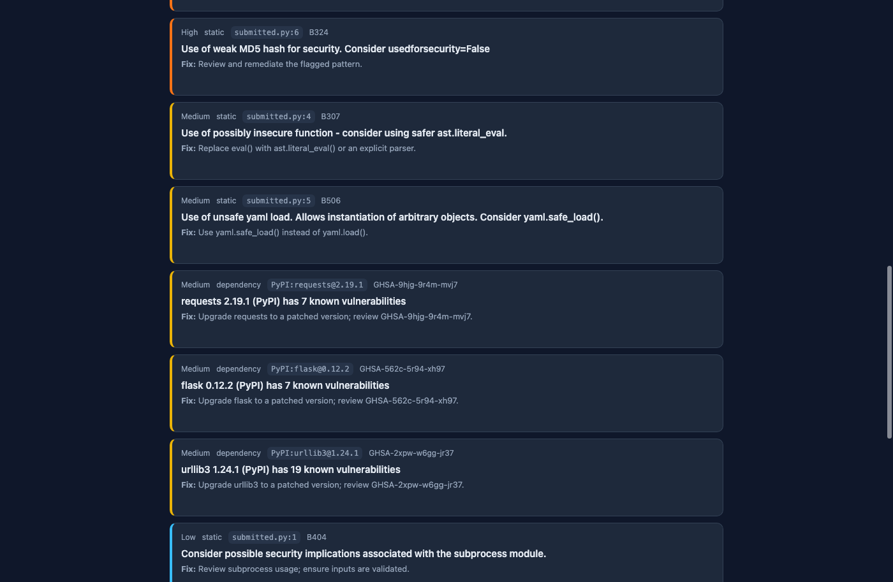
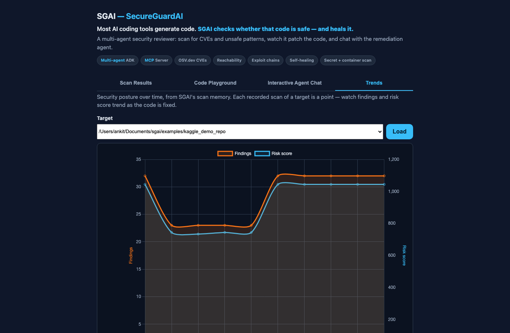

# SGAI — SecureGuardAI

> A multi-agent security reviewer that audits a codebase for vulnerable dependencies and unsafe code patterns, scores them by risk, explains them, and proposes fixes — and remembers what changed since last time.

**Kaggle AI Agents: Intensive Vibe Coding Capstone — Track: Freestyle**

[](https://sgai-n2ov.onrender.com)
[](https://github.com/ankitranjan-dsai/SGAI/actions/workflows/ci.yml)
[](https://github.com/ankitranjan-dsai/SGAI/releases)
[](https://github.com/ankitranjan-dsai/SGAI/pkgs/container/sgai)
[](pyproject.toml)
[](LICENSE)

| | |
|---|---|
| **Live demo** | **[sgai-n2ov.onrender.com](https://sgai-n2ov.onrender.com)** — paste a public GitHub URL and scan it. No sign-up, no API key. Free tier sleeps when idle, so the first load can take ~50s. |
| **Demo video** | [Watch on YouTube](https://youtu.be/deRzztaJo9E) |
| **Kaggle writeup** | [Read on Kaggle](https://kaggle.com/competitions/vibecoding-agents-capstone-project/writeups/new-writeup-1782074784033) |
| **Judging checklist** | [Kaggle Judging Checklist](#kaggle-judging-checklist) below |

---

## Quick Judge Run (under 5 minutes, no API key needed)

```bash
git clone https://github.com/ankitranjan-dsai/SGAI.git && cd SGAI
uv sync                                              # ~10s, installs everything via uv
uv run pytest -q                                     # full test suite, all green
uv run sgai scan ./examples/kaggle_demo_repo         # deterministic scan — ~20+ findings, no key
uv run sgai scan ./examples/kaggle_demo_repo --deep  # + Semgrep multi-language SAST
uv run sgai history ./examples/kaggle_demo_repo      # scan timeline (Sessions & Memory)
uv run sgai check ./examples/kaggle_demo_repo        # Policy-as-Code CI gate (exits 1 on violation)
./run.sh                                             # web app at http://localhost:8080
```

Every command above needs **no Google API key** — the deterministic core (OSV.dev
+ Bandit/Semgrep) never calls an LLM. A free Gemini key only unlocks
`--explain` (narrated report) and `--agentic` (fully autonomous tool-calling).
See [docs/demo.md](docs/demo.md) for the full walkthrough and
[docs/kaggle_submission.md](docs/kaggle_submission.md) for the submission checklist.

---

## Problem

AI coding assistants now write huge amounts of code, fast. Almost none of it is
checked for *security* before it ships: a pinned dependency with a known CVE, a
`subprocess(…, shell=True)`, a `yaml.load` on untrusted input. Security review is
slow, specialized, and easy to skip — so vulnerabilities pile up silently, and
nobody can answer "is this getting better or worse since last week?"

## Solution

SGAI points a team of specialist agents at any repository — a local path or a
GitHub URL. They audit dependency manifests across **PyPI, npm, Go, and
crates.io** (requirements, `pyproject.toml`, `poetry.lock`, `uv.lock`,
`Pipfile.lock`, `package-lock.json`, `go.mod`, `Cargo.lock`) against the live
[OSV.dev](https://osv.dev) database, run **Bandit**
static analysis on Python (and optional **Semgrep** multi-language analysis with
`--deep`), de-duplicate and risk-rank the findings, write a remediation-ready
report, and can preview dependency fixes — and optionally open a remediation PR
for a repo you own. Because it stores every scan, it also tells you exactly
**what's new, what's fixed, and what's still open** since the last run.

Five capabilities take it past a scanner:

- **Self-healing patches** (`sgai heal`) — maps Bandit/Semgrep findings to
  AST-safe refactorings (`yaml.load`→`yaml.safe_load`, `eval`→`ast.literal_eval`,
  `shell=True`→`shlex.split`, weak hashes→`sha256`, hardcoded secrets→env vars),
  applies them, runs the project's own tests through a sandboxed `validate_patch`
  tool, and **rolls back any patch that breaks the suite**.
- **Dependency reachability** — a static import graph decides whether a
  vulnerable package is actually imported. Reachable CVEs are **upgraded** in
  severity; unused ones are **downgraded**, so triage targets what's exploitable.
- **Threat modeling & exploit chains** — correlates individual findings into
  end-to-end attack paths (e.g. path-traversal + hardcoded key → credential
  disclosure), rendered as **Mermaid graphs** in the report.
- **Container & secret scanning** — Dockerfile/compose/Terraform misconfigurations
  (unpinned base images, root/privileged containers, open CIDRs) plus
  entropy-based secret detection with an **LLM pass to weed out dummy credentials**.
- **Interactive playground** — a web UI to watch code get patched in a
  side-by-side diff and **chat with the remediation agent over SSE** to refine fixes.

It runs three ways from one codebase: a **CLI**, a **mobile-friendly web app**,
and a reusable **MCP server** any agent can call.

> **Scope, stated honestly:** Python-first static analysis (Bandit) +
> multi-ecosystem dependency-manifest CVE scanning + optional Semgrep
> multi-language static analysis under `--deep`.

### Advanced suite (v3)

Building on the pillars above — **zero-LLM detection** (all detection is fast,
deterministic local analysis; the LLM only narrates, triages, and powers the
chat copilot) and **deterministic scan diffs** (`source:id:location`
fingerprints in a JSON `ScanMemory`) — SGAI adds:

- **Self-healing v2** — `validate_patch` auto-detects and runs `pytest`,
  `npm test`, `go test`, and `cargo test` under a strict 30 s timeout;
  patch **confidence scoring** orders rewrites; a **binary-search rollback**
  isolates the minimal breaking subset in `O(b·log n)` test runs.
  `POST /commit-patch` writes a validated diff inside the sandbox.
- **Reachability v2** — production-vs-test file classification, **transitive
  import closure**, and a multi-language import graph (Python, JS/TS, Go, Rust).
  Test-only imports are downgraded; production imports upgraded. Each finding
  carries a tri-state `reachability` (`production` / `test_only` / `unreached`).
- **CVSS-accurate dependency severity** — each advisory's full OSV record is
  fetched and its CVSS vector (v4 > v3 > v2) scored into the standard bands
  (≥9.0 Critical, ≥7.0 High, ≥4.0 Medium, else Low), falling back to the
  database's own label, then HIGH only when no signal exists — so a CVSS 9.8
  RCE and a CVSS 3.1 ReDoS no longer rank identically.
- **Typosquatting detector** — flags dependency names one edit, an adjacent
  transposition, a homoglyph, or an affix away from a popular package
  (`requsts`, `lodahs`, `crypt0graphy`, `requests2`) — supply-chain risk caught
  before any CVE exists. Pure string analysis, zero network.
- **Context-aware secrets** — the LLM verifier sees rich context (file, variable,
  surrounding lines/comments) with **every secret value masked**; test/fixture
  secrets auto-downgrade to Info; each finding gets a **rotation-urgency** score.
- **Threat modeling v2** — user `custom_chains.json` templates, a
  **recommended fix order** to break each chain (numbered `🔧1 → 🔧2` directly
  on the Mermaid graph), **internet-facing** entry-point weighting, and raw
  Mermaid handed to the triage agent.
- **Security copilot UI** — clickable finding cards seed a contextual chat, a
  **Commit patch** button re-validates fixes, chat sessions persist per target,
  and a multi-file playground shows cross-file patches.
- **Policy-as-Code** — `.sgai/policy.yml` gates (`no-critical-in-production`,
  `max-unpatched-cves`, …); `sgai check` exits non-zero on violation for CI.
- **PR differential scanning** — `git diff` delta analysis reports only findings
  **newly introduced** by a change; `POST /scan/pr` posts inline GitHub reviews.
- **SBOM & VEX** — `GET /sbom` (CycloneDX/SPDX) and `GET /vex` (OpenVEX, mapping
  reachability to `affected` / `not_affected` / `under_investigation`).
- **False-positive dismissals** — `POST /dismiss` + `/undismiss`; dismissed
  findings (by fingerprint or pattern) are auto-suppressed on future scans.
- **Trend dashboard** — `GET /trends` and a Chart.js **Trends** tab plotting
  findings and risk score over time from `ScanMemory`.

## Why agents?

A security audit is naturally parallel and specialized. No single prompt can
simultaneously enumerate source files, query a CVE database, run a static
analyzer, reason about exploitability, and write patches. SGAI gives each of
those jobs to a dedicated agent and coordinates them with an orchestrator — which
is what makes the multi-agent architecture *necessary* rather than decorative.

## Architecture

```
                          ┌──────────────────────┐
        target repo  ──▶  │   OrchestratorAgent  │
                          └──────────┬───────────┘
                                     │ coordinates
        ┌────────────┬───────────────┼───────────────┬──────────────┐
        ▼            ▼               ▼               ▼              ▼
  ScannerAgent  DependencyAudit  StaticAnalysis  RiskScoring   Remediation
   (enumerate    (OSV.dev CVE     (Bandit/Semgrep) (dedupe +    (propose
    sources)      lookup)                          rank)         fixes)
        │            │               │               │              │
        └────────────┴───────────────┴───────┬───────┴──────────────┘
                                              ▼
                                       ReportAgent
                              (prioritized Markdown report
                                  + optional GitHub PR)
```

All security tooling (CVE lookups, static analysis, sandboxed file reads) is
exposed through a **custom MCP server** the agents call as tools — cleanly
decoupled, independently testable, and reusable by any MCP-compatible client.
See [docs/architecture.md](docs/architecture.md).

## Required course concepts demonstrated — all 6, plus Sessions & Memory

| Concept | How SGAI demonstrates it |
|---|---|
| **Multi-agent system (ADK)** | Orchestrator + 6 specialist agents, plus a triage→report narration pipeline, built on Google's Agent Development Kit |
| **MCP Server** | Custom server (`src/sgai/mcp_server`) exposing OSV.dev CVE lookup, Bandit + Semgrep static analysis, and sandboxed file tools |
| **Security features** | Sandboxed file access (path-traversal + symlink safe), least-privilege per-agent toolsets, stateless requests, input validation — see [docs/security.md](docs/security.md) |
| **Deployability** | Stateless FastAPI service (`src/sgai/api.py`) + Dockerfile, Cloud Run ready — see [docs/deploy.md](docs/deploy.md) |
| **Agent skills / Agents CLI** | Packaged as the `sgai` CLI and a reusable skill ([SKILL.md](SKILL.md)); installable with `uv tool install` |
| **Antigravity** | Security MCP server plugs into Antigravity (and any MCP agent) — see [docs/integrations.md](docs/integrations.md) |
| **Sessions & Memory** *(course Day 3)* | Persistent per-target scan memory (`src/sgai/memory.py`) reports **new / fixed / still open** since the last scan and remembers accepted risks; also exposed as a real ADK `MemoryService` so agents can recall prior scans via `load_memory` |

## Kaggle Judging Checklist

A direct map from what's judged to exactly where to look. Every command below
was re-run against this commit while preparing the submission.

| Judging area | Points | Exact evidence | Command / file |
|---|---|---|---|
| **Pitch, problem, solution, value** | 30 | Problem/Solution sections above; full writeup | [SUBMISSION.md](SUBMISSION.md) |
| **Multi-agent system (ADK)** | Technical (50) | Real `LlmAgent`/`SequentialAgent`/`ParallelAgent` graph, not a single prompt | [src/sgai/agents/orchestrator.py](src/sgai/agents/orchestrator.py), [narrator.py](src/sgai/agents/narrator.py) |
| **MCP Server** | Technical (50) | Custom FastMCP server, 9 tools, sandboxed | [src/sgai/mcp_server/server.py](src/sgai/mcp_server/server.py) — `uv run python -m sgai.mcp_server.server` |
| **Security features** | Technical (50) | Path-sandboxed file access, least-privilege per-agent tool filters | [src/sgai/mcp_server/sandbox.py](src/sgai/mcp_server/sandbox.py), [docs/security.md](docs/security.md), `uv run pytest tests/test_sandbox.py -q` |
| **Deployability** | Technical (50) | Stateless FastAPI + Dockerfile + published public container | `docker pull ghcr.io/ankitranjan-dsai/sgai:latest`, [docs/deploy.md](docs/deploy.md) |
| **Agent skills / Agents CLI** | Technical (50) | `sgai` console script + [SKILL.md](SKILL.md) | `uv tool install . && sgai scan <target>` |
| **Sessions & Memory** | Technical (50) | Cross-scan diffing + ADK `MemoryService` adapter | [src/sgai/memory.py](src/sgai/memory.py), `uv run sgai history ./examples/kaggle_demo_repo` |
| **Working code / tests** | Technical (50) | Full automated suite, green | `uv run pytest -q` (all passing — see [Quick Judge Run](#quick-judge-run-under-5-minutes-no-api-key-needed) above for exact count) |
| **CI/CD proof** | Technical (50) | 4 green GitHub Actions workflows on `main` | [Actions tab](https://github.com/ankitranjan-dsai/SGAI/actions) |
| **Documentation** | 20 | README + 10 docs files + honest known-limitations section | [docs/](docs) — start with [architecture.md](docs/architecture.md) |
| **Demo clarity** | Docs (20) / Pitch (30) | Reproducible commands, sample vulnerable repo, timed video script | [Demo Script](#demo-script-23-min) below, [docs/demo.md](docs/demo.md) |

## Demo Script (2–3 min)

A short, judge-facing walkthrough — a live camera-ready version with more
detail (deployability, memory diff, self-healing, architecture recap) is
scripted minute-by-minute in [docs/video_script.md](docs/video_script.md)
(rehearsed, ≤5:00, for the actual Kaggle submission video). This condensed
version hits the same beats in ~2–3 minutes:

1. **[0:00–0:20] The problem.** Say it in one breath: "AI writes most code now;
   almost none of it gets security-reviewed before it ships." Show the README
   hero line.
2. **[0:20–0:55] Live scan, no key needed.**
   ```bash
   uv run sgai scan ./examples/kaggle_demo_repo --deep
   ```
   Point at the severity table and one finding's remediation line.
3. **[0:55–1:25] It's agentic, not a linter.** Open
   `src/sgai/agents/orchestrator.py` for 3 seconds — orchestrator +
   ParallelAgent fan-out — then run:
   ```bash
   uv run sgai scan ./examples/kaggle_demo_repo --explain
   ```
   (needs a free Gemini key) and read one line of the narrated report aloud.
4. **[1:25–1:55] Memory.** Re-run the same scan command and point at the
   `Changes since last scan: 0 new · 0 fixed · N still open` banner, then
   `uv run sgai history ./examples/kaggle_demo_repo`.
5. **[1:55–2:25] It fixes things.**
   ```bash
   uv run sgai heal ./examples/kaggle_demo_repo --dry-run
   ```
   Show the diff — AST-safe patch, not a suggestion in prose.
6. **[2:25–2:45] It's deployable.** Show
   `ghcr.io/ankitranjan-dsai/sgai:latest` on GitHub Packages (public, no
   login) or run `./run.sh` and open `localhost:8080`.
7. **[2:45–3:00] Close.** "MCP-native, multi-agent, deployable, open source —
   link in the description."

## Quick start

**Just double-click — no terminal needed:**

| OS | Double-click | Or from a terminal |
|---|---|---|
| **macOS** | `run.command` | `./run.sh` |
| **Windows** | `run.bat` | `./run.ps1` (PowerShell) |
| **Linux** | — | `./run.sh` |

Any of these installs everything it needs (via [`uv`](https://docs.astral.sh/uv/)),
starts SGAI, and opens **http://localhost:8080** once the server is ready.

> First macOS double-click: if you see "unidentified developer", right-click
> `run.command` → **Open** → **Open** (only needed once). On Windows, `run.bat`
> handles the PowerShell execution policy for you.

## Web demo

SGAI's web app is mobile-first:

1. **Same Wi-Fi:** open `http://<your-computer-ip>:8080` on your phone.
2. **Deployed:** host it on Cloud Run (below) and open the public URL anywhere.

Paste a `requirements.txt` and/or some code (or click **Use sample vulnerable
input**), tap **Scan**, and get a ranked report with a risk summary, findings +
fixes, and the "changes since last scan" diff — no install on the phone. The UI
has four tabs:

1. **Scan Results** — the ranked report, with exploit-chain **Mermaid** diagrams.
2. **Code Playground** — paste code and watch SGAI patch it in a **side-by-side diff**.
3. **Interactive Agent Chat** — chat with the remediation agent over **SSE** to
   refine a fix, then apply it back into the playground.
4. **Trends** — a Chart.js view of findings and risk score over time, pulled
   from scan memory (`GET /trends`).

### Screenshots

| Scan input | Scan results | Trends |
|---|---|---|
|  |  |  |

Or run it yourself: `./run.sh` and open `http://localhost:8080` (under a
minute, no API key required for the deterministic scan).

## Demo commands

A self-contained, intentionally-vulnerable repo lives at
[`examples/kaggle_demo_repo`](examples/kaggle_demo_repo) — PyPI + npm + Go
dependency CVEs, unsafe Python for Bandit, and an insecure `server.js` for
Semgrep. **No API key required.**

```bash
uv run sgai scan ./examples/kaggle_demo_repo            # rich report — typically ~20+ findings (deps + Bandit)
uv run sgai scan ./examples/kaggle_demo_repo --deep     # Semgrep adds more findings when available
uv run sgai scan ./examples/kaggle_demo_repo --sarif out.sarif
uv run sgai history ./examples/kaggle_demo_repo         # the scan timeline
```

## CLI usage

Requires Python 3.11+ and [`uv`](https://docs.astral.sh/uv/) (`uv` will fetch a
matching Python automatically if you don't have 3.11+ on PATH).

```bash
uv sync                                       # create venv + install deps (incl. dev tools)

uv run sgai scan ./examples/vulnerable_app    # deterministic scan, NO API key
uv run sgai scan https://github.com/owner/repo   # audit any public repo by URL
uv run sgai scan ./examples/multi_lang --deep    # + Semgrep multi-language SAST
uv run sgai scan ./path --sarif out.sarif        # SARIF 2.1.0 for code scanning

uv run sgai fix ./examples/vulnerable_app     # preview dependency upgrades (dry run)
uv run sgai fix . --open-pr                    # open a remediation PR (repo you own)

uv run sgai heal ./path --dry-run             # preview AST-safe code patches (diff)
uv run sgai heal ./path                        # apply patches, validated by the repo's tests

uv run sgai check ./path                       # CI gate: exits non-zero on policy violation

uv run sgai scan ./path --explain             # multi-agent narrated report (Gemini)
uv run sgai scan ./path --agentic             # fully autonomous: orchestrator + 6-agent
                                              #   pipeline doing its own MCP tool calls
                                              #   (needs Gemini quota headroom)
uv run sgai history ./path                     # scan timeline (new/fixed over time)
uv run sgai accept ./path <finding-id> --reason "tracked in JIRA-123"

uv run python -m sgai.mcp_server.server       # run the security MCP server standalone
```

### HTTP API (deployable service)

Beyond `GET /health`, `GET /`, and `POST /scan[/stream]`, the service exposes:
`POST /commit-patch`, `POST /heal` + `POST /heal/multi`, `POST /chat` (SSE) +
`WS /chat/ws` (bidirectional) + `GET/POST/DELETE /chat/session`,
`POST /scan/check`, `POST /scan/pr`, `POST /fix/plan`,
`GET /sbom`, `GET /vex`, `POST /dismiss` + `POST /undismiss`, and `GET /trends`.

A free Gemini key (https://aistudio.google.com/apikey) is **only** needed for
`--explain`; the free tier's 5 req/min is enough for the lean two-agent narration.

## MCP tools

Running `python -m sgai.mcp_server.server` gives any MCP client these tools:

| Tool | Purpose |
|---|---|
| `scan_manifest` | Audit a dependency manifest (PyPI/npm/Go/crates.io) against OSV.dev |
| `scan_dependency` | Check a single package for CVEs |
| `scan_requirements_file` | Audit a whole `requirements.txt` |
| `run_static_analysis` | Bandit static analysis (Python) |
| `run_semgrep` | Multi-language static analysis (optional) |
| `scan_dockerfile` | Dockerfile / compose / Terraform misconfiguration checks |
| `scan_secrets` | High-entropy + known-format secret detection (LLM dummy filtering) |
| `validate_patch` | Run the target project's own tests inside the sandbox (self-healing) |
| `list_source_files` / `read_source_file` | Sandboxed source access |

Wiring it into Antigravity, Claude Code, or the Gemini CLI: see
[docs/mcp.md](docs/mcp.md) and [docs/integrations.md](docs/integrations.md).

## Memory — "what changed since last scan?"

A one-off report tells you what's wrong *now*. SGAI also **remembers every scan
of a target** and answers what teams ask at standup: *what changed?*

```bash
uv run sgai scan ./myproject           # 1st run: saves a baseline
# …fix some deps, introduce others…
uv run sgai scan ./myproject           # 2nd run: "3 new · 1 fixed · 8 still open"
uv run sgai history ./myproject        # the full scan timeline
uv run sgai accept ./myproject CVE-... --reason "patch scheduled Q3"
```

Every report gains a **Changes since last scan** section; accepted risks stop
being flagged as new. Memory lives in `~/.sgai/` (override with `$SGAI_HOME`);
GitHub-URL targets are tracked by URL, so the web app and deployed service
remember repos across scans too.

## Security design

SGAI is built to be safe to point at untrusted code: sandboxed file access
(path-traversal + symlink safe), least-privilege per-agent MCP toolsets,
stateless request handling (pasted code is scanned in a throwaway temp dir and
never stored), no secrets in code (env vars + `.env.example`), and an optional,
local-only PR step. Full details in [docs/security.md](docs/security.md).

## Deployment

SGAI ships as a stateless HTTP service and a container image.

```bash
# Local:
uv run uvicorn sgai.api:app --host 0.0.0.0 --port 8080

# Docker — published image (no build needed):
docker run -p 8080:8080 ghcr.io/ankitranjan-dsai/sgai:latest

# Docker — build locally:
docker build -t sgai . && docker run -p 8080:8080 sgai

# Google Cloud Run:
gcloud run deploy sgai --source . --region us-central1 --allow-unauthenticated
```

Full guide (incl. wiring the optional Gemini key as a secret):
[docs/deploy.md](docs/deploy.md).

## Known limitations

- **Static analysis is Python-only (Bandit).** Other languages are covered by
  dependency-manifest CVE scanning and, under `--deep`, optional Semgrep.
- **Semgrep is fetched at runtime** via `uvx`; if unavailable it is skipped
  gracefully (the rest of the scan still runs).
- **Severity enrichment costs one extra OSV fetch per unique advisory.** An
  advisory whose record carries no CVSS vector or database label (rare; some
  PYSEC entries) falls back to **High**.
- **Memory matches findings by `source:id:location`, with line-shift
  tolerance.** A static finding whose line moved (code edited above it) is
  recognized as the same issue; a same-id finding that moves *files* still
  reads as one fixed and one new.
- **Fully-autonomous tool-calling pipeline needs higher Gemini quota.** The
  default `--explain` path uses just two LLM calls to stay within the free tier;
  the deterministic core needs no key at all.

## CI/CD integration

SGAI gates its own repository with the workflows in
[`.github/workflows/`](.github/workflows) — copy them into any repo for the
same setup:

- **`ci.yml`** — tests, lint, and a dogfooded `sgai check .` self-audit.
- **`sgai-security.yml`** — on every PR: full scan uploaded as SARIF to the
  GitHub Security tab, then `sgai check .` as the merge gate, so a
  `.sgai/policy.yml` violation blocks the merge.
- **`sgai-dependency-audit.yml`** — weekly cron that re-audits every pinned
  dependency against OSV.dev and opens an upgrade PR (`sgai fix --open-pr`)
  when a new CVE lands.
- **`release.yml`** — builds and publishes the `ghcr.io/ankitranjan-dsai/sgai`
  container image to GitHub Packages on every `v*` tag.

This repo's own policy lives at [`.sgai/policy.yml`](.sgai/policy.yml); an
annotated copy ships in [`examples/policy.yml`](examples/policy.yml), and a
custom exploit-chain template in
[`examples/custom_chains.json`](examples/custom_chains.json).

## License

MIT © 2026 Ankit Ranjan
